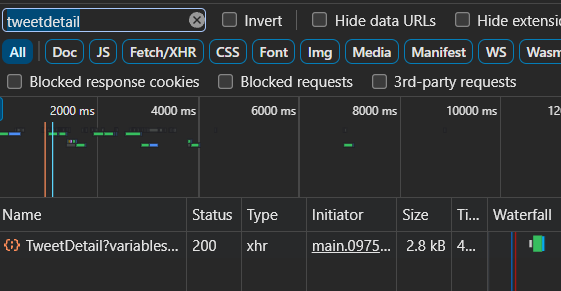
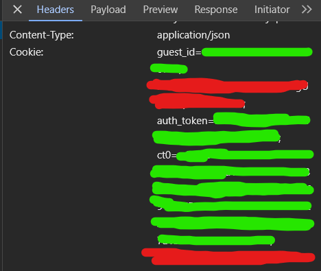

# Simple twitter post downloader
## How it works
This code uses the new v2 api twitter uses, and it uses guest authentication to fetch information about the tweet from the graphql api. It gets the authorization bearer from a main.js file and generates a guest token from the official api.

Won't bother adding manifest downloading as there is no difference in formats and would take longer to download than a direct link.

Gifs are stored as mp4, you can convert it to gifs with ffmpeg.

Normal videos are tag 12, and longer videos are tag 14, but I haven't seen any difference in downloading or direct link storing (downloaded big movies with it no issue)

Guest token expires, but bearer token doesn't, so its cached in a txt file to avoid unnecessary bandwidth.

Accepts x.com and twitter.com links.

Media links embed in discord but longer and bigger videos require embed bypass [https://discord.nfp.is](https://discord.nfp.is)
## Setup
Python 3.10.9
```bash
git clone https://github.com/Hecker5556/twitterdownloader.git
```
```bash
cd twitterdownloader
```
```bash
pip install -r requirements.txt
```

## Usage
```
usage: twitterdownloader.py [-h] [-m MAX_SIZE] [-r] link

positional arguments:
  link                  link to twitter post

options:
  -h, --help            show this help message and exit
  -m MAX_SIZE, --max-size MAX_SIZE
                        max size in mb of a video
  -r, --return-url      print urls of medias instead of download
```

```python
import sys
if "path/to/twitterdownloader.py" not in sys.path:
    sys.path.append("path/to/twitterdownloader.py")
import twitterdownloader
result = twitterdownloader.downloader("link", maxsize=None, returnurl=False)
filenames = result.get("filenames")
author = result.get("author")
caption = result.get("caption")
```

## Get private/nsfw videos with authenticated fetching
### Step 1. Create an env.py file in the same directory as the code, and put this there
```python
guest_id = '' 
auth_token = '' 
csrf = ''
```
### Step 2. Go to twitter, find a nsfw/private video
Example: [https://x.com/sacredgraves/status/1707962195357630713?s=46](https://x.com/sacredgraves/status/1707962195357630713?s=46)
### Step 3. Open developer tab, go to network, hit refresh
### Step 4. search up tweetdetail



### Step 5. Find the guest_id, auth_token and ct0



### Step 6. Add them to the env.py file, ct0 is the csrf token