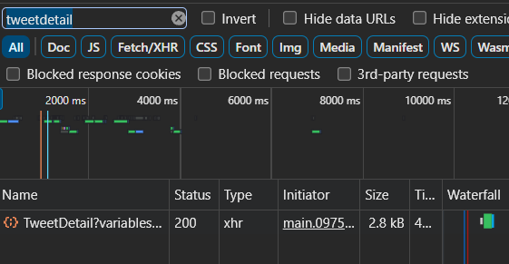
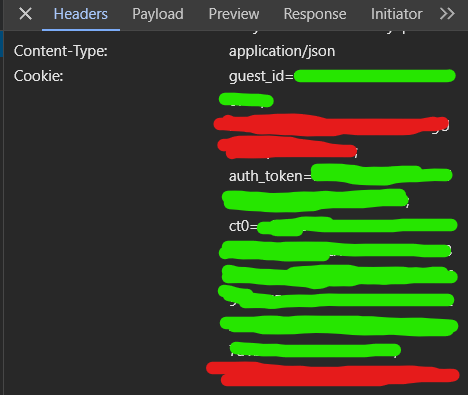

# Simple twitter post downloader
## How it works
By default searches through website source, extracts either seroval type information and parses it, or a raw response. Optionally, using credentials uses the X API to fetch post information. X API is no longer supported without credentials.

Gifs are stored as mp4, you can convert it to gifs with ffmpeg.

Guest token expires, but bearer token doesn't, so its cached in a txt file to avoid unnecessary bandwidth.

Accepts x.com and twitter.com links.

Media links embed in discord but longer and bigger videos require embed bypass [https://discord.nfp.is](https://discord.nfp.is)

Inserts captions into video if avaliable (using ffmpeg), if caption_videos is True, burns them in.

Capability to download manifest (DASH) formats.

New class Grok to start chats with and generate images with (requires authentication).
## Setup
Written in Python 3.10.9
In env of your choice:
```
pip install "git+https://github.com/Hecker5556/twitterdownloader"
```

## Usage
```
usage: twitterdownloader [-h] [-m MAX_SIZE] [-r] [-p PROXY] [-d] [-c] [--credentials CREDENTIALS] [-dbg] link

positional arguments:
  link                  link to twitter post

options:
  -h, --help            show this help message and exit
  -m MAX_SIZE, --max-size MAX_SIZE
                        max size in mb of a video
  -r, --return-url      returns urls of medias instead of download
  -p PROXY, --proxy PROXY
                        https/socks proxy to use
  -d, --dash            download dash video format instead of direct
  -c, --caption         burn in twitter given captions into the video
  --credentials CREDENTIALS, -f CREDENTIALS
                        Location containing credentials in JSON format, more on README.md
  -dbg, --debug         debug settings
```
```
usage: grok [-h] credentials

positional arguments:
  credentials  Location containing credentials in JSON format, more on README.md

options:
  -h, --help   show this help message and exit
```

```python
from twitterdownloader import TwitterDownloader
import asyncio
#non async
def main_():
    downloader = TwitterDownloader()
    result = asyncio.run(downloader.download("https://x.com/BronzeAya/status/1869967014695141528"))
    print(result)
#async
async def main():
    downloader = TwitterDownloader()
    result = await downloader.download("https://x.com/BronzeAya/status/1869967014695141528")
    print(result)
    #optional credentials
    credentials = {
      "guest_id": "v1..." ,
      "auth_token": "2..." ,
      "csrf": "4..."
    }
    authenticated_downloader = TwitterDownloader(credentials=credentials)
    result = await authenticated_downloader.download("url...")
asyncio.run(main())
```
Grok
```python
from twitterdownloader import Grok
import asyncio
async def main():
  credentials = {
    "guest_id": "v1..." ,
    "auth_token": "2..." ,
    "csrf": "4..."
  }
  async with Grok(credentials=credentials) as grok:
    await grok.start_chat()
    result = await grok.add_response("hi how are you")
    print(result.get("message"))
    if result.get("images"):
      print(f"Following images have been generated:{a}{a.join([x.get('fileName') for x in result.get('images')])}")
asyncio.run(main())
```
## Get private/nsfw videos with authenticated fetching / use grok
### Step 1. Create a config file in JSON format
### Step 2. Go to twitter, find a nsfw/private video
Example: [https://x.com/sacredgraves/status/1707962195357630713?s=46](https://x.com/sacredgraves/status/1707962195357630713?s=46)
### Step 3. Open developer tab, go to network, hit refresh
### Step 4. search up tweetdetail



### Step 5. Find the guest_id, auth_token and ct0



### Step 6. Add them to the JSON file as such:
```json
{
  "guest_id": "v1..." ,
  "auth_token": "2..." ,
  "csrf": "4..."
}
```
ct0 is csrf.